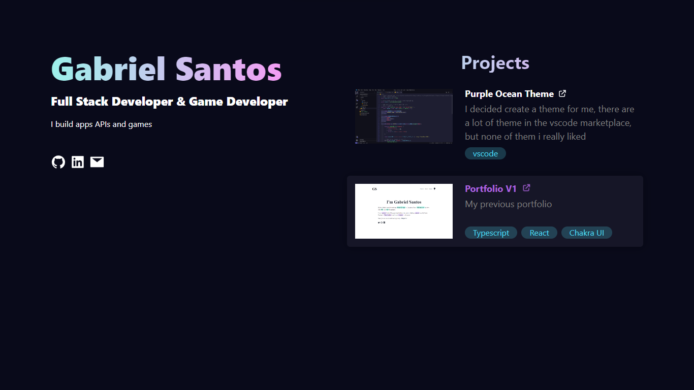

# Portfolio V2

This portfolio is the second version, was developes with React, typescript and Chakra UI to see the live click <a href="https://gbcostasant.netlify.app/"> here </a>

Click <a href="https://gbcostasantv1.netlify.app/"> here </a> to see the first version

